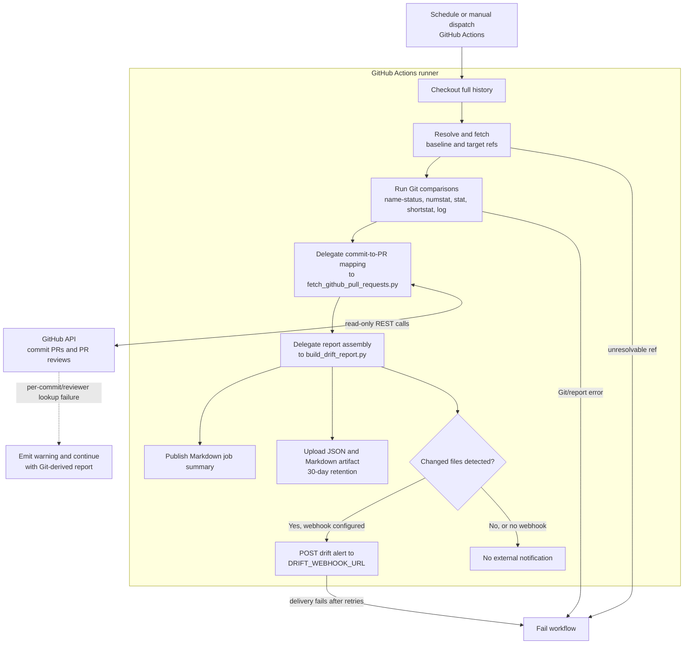

# DriftCheck

## Scheduled repository drift reporting

[`.github/workflows/drift-report.yml`](.github/workflows/drift-report.yml) runs at **06:17 UTC, Monday through Friday**, and can also be started from **Actions → Scheduled drift report → Run workflow**. A manual run accepts `baseline` and `target` values; each can be a branch, tag, or commit SHA. Scheduled runs compare `main` to `HEAD` (the checked-out default-branch tip). Update the `workflow_dispatch` defaults and the workflow `BASELINE`/`TARGET` expressions if this repository uses different long-lived refs.

## Activity delegation chart

The chart shows which component owns each activity and the paths taken when drift, API lookup warnings, or workflow failures occur.



The workflow checks out full history, resolves/fetches both refs, and records these comparison commands exactly in its source:

```bash
git diff --name-status <baseline>...<target>
git log --format='%H%x1f%an%x1f%ae%x1f%aI%x1f%s' <baseline>..<target>
```

It also runs `git diff --numstat`, `git diff --stat`, and `git diff --shortstat`. The resulting artifact contains both:

- `drift-report.json` — machine-readable refs, changed-file statuses, per-file additions/deletions, raw stat output, commits/authors, and merged-PR metadata.
- `drift-report.md` — a readable version with the precise name/status and statistic summaries.

For every target-side commit, `scripts/fetch_github_pull_requests.py` calls GitHub's commit pull-request endpoint and, for each merged PR, its reviews endpoint. It reports the PR number, title, creator, URL, merge time, and reviewer logins when GitHub returns them. Commits without an API mapping are explicitly shown as such.

## Configuration and access

The workflow uses least-privilege workflow permissions only:

- `contents: read` to fetch and compare repository history.
- `pull-requests: read` to map commits and read reviewers.

Create these **repository or organization secrets** in GitHub Actions; restrict organization secrets to only repositories that need this workflow and keep them unavailable to untrusted forks/environments.

| Secret | Required | Scope and purpose |
| --- | --- | --- |
| `DRIFT_GITHUB_TOKEN` | Recommended | A fine-grained GitHub token limited to this repository with **Contents: Read** and **Pull requests: Read**. It is used for the GitHub REST calls. When omitted, the workflow uses the automatically scoped `GITHUB_TOKEN` fallback. |
| `DRIFT_WEBHOOK_URL` | Optional | A protected HTTPS incoming-webhook URL for the alert destination (for example Slack, Teams, or an internal relay). The workflow posts only when changed files are detected. |

Do not put either credential in workflow YAML, command output, reports, or repository variables. For GitHub environments, place the secrets in an environment with required reviewers if alert delivery needs an additional approval boundary.

## Artifacts, alerts, and failures

Each successful comparison uploads a `drift-report-<run id>` artifact retained for **30 days**. Change `retention-days` in the upload step to fit your retention policy. The Markdown report is also added to the Actions job summary.

A webhook alert is sent only if drift is detected and `DRIFT_WEBHOOK_URL` is set; an empty webhook secret deliberately produces no external alert. Configure the destination's own authentication and retention according to its service policy.

The job fails if either comparison ref cannot be fetched/resolved, Git commands fail, report generation fails, or a configured webhook cannot be delivered after retries. GitHub API lookup failures for individual commits or reviewers are warnings: the report is still published with the unavailable mapping omitted, so a transient API issue does not hide the Git-derived drift result. Inspect the job log and artifact, correct the ref/token/webhook configuration, then rerun manually.
